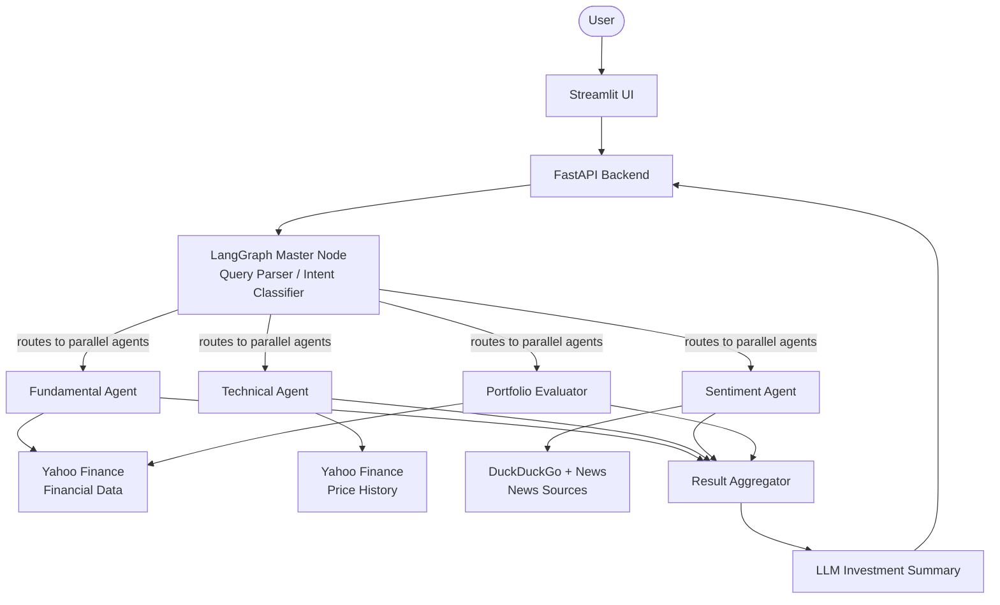

# Multi-Agent Market Analyst - Complete System Architecture

## 1. System Goal

Build a multi-agent market analyst that gathers stock data, analyzes it using specialized agents, and produces a combined investment insight through an orchestrating master node.

The system answers three major query categories:
1. **Single stock analysis** – Example: "How is Reliance doing?"
2. **Portfolio analysis** – Example: "How is my portfolio performing?"
3. **Stock comparison & recommendation** – Example: "Tata Motors vs Mahindra & Mahindra — which is better?"

---

## 2. Core Architecture Layers

The system is structured into five layers to ensure scalability, modularity, and easier agent orchestration.

| Layer               | Responsibility                 |
| ------------------- | ------------------------------ |
| UI Layer            | User interaction               |
| API Layer           | Request routing                |
| Orchestration Layer | Multi-agent coordination       |
| Agent Layer         | Specialized financial analysis |
| Data Layer          | Market and news data sources   |

---

## 3. High-Level Architecture Diagram

---

## 4. Main Components Explained

### 4.1 Streamlit UI Layer
Streamlit acts as the interactive dashboard where users ask financial queries.
* **Features:** Ask stock questions, Portfolio input, Compare stocks, Display charts, Show analysis results.

### 4.2 FastAPI Backend (API Layer)
FastAPI acts as the system gateway that receives user requests and triggers the LangGraph pipeline via REST APIs (e.g., `/analyze`).

### 4.3 LangGraph Multi-Agent System (Orchestration Layer)
LangGraph orchestrates multiple agents and manages execution flow.
The **Master Node** decides:
* Which agents to activate based on LLM Intent detection (Single Stock vs Portfolio vs Comparison).
* To run agents **in parallel** via a LangGraph state network.

### 4.4 Agent Layer
* **Fundamental Analyst Agent**: Evaluates financial health of companies (P/E ratio, Revenue growth, Profit margin, Debt/Equity, ROE).
* **Technical Analyst Agent**: Analyzes stock price patterns (50/200 Day Moving averages, RSI, MACD).
* **Sentiment Analyst Agent**: Understands market perception from news and DuckDuckGo using LLMs (scoring 1.0 to 10.0).
* **Portfolio Analyst Agent**: Evaluates overall portfolio performance by looping parallel individual agents across multiple tickers concurrently.

### 4.5 Data Sources Layer
* **Stock price & Financial statements**: `yfinance` 
* **News**: `duckduckgo-search`
* **Technical Indicators**: Pandas manually built (`pandas-ta` had Python 3.11 compatibility issues)

---

## 5. Result Aggregation Layer

The `Aggregator Node` merges raw JSON outputs from all specialized agents into a comprehensive LangChain prompt, converting data (e.g., "Score: 7.5, Technical Score: 8") into an LLM-generated cohesive investment summary for the user interface.

## 6. Development Build Plan (Phases)

* **Phase 1** — Data Infrastructure (Tools/Utils testing)
* **Phase 2** — Individual Agents (Structured JSON evaluation logic)
* **Phase 3** — LangGraph Orchestration & Parallel Nodes
* **Phase 4** — FastAPI Backend (State persistence execution)
* **Phase 5** — Streamlit Dashboard (UI execution)
